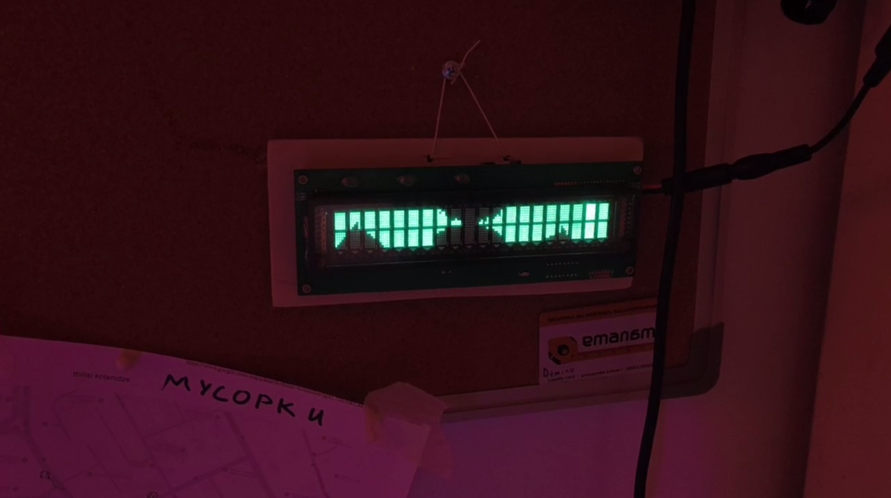

# F0RTHSP4CE <abbr title="Vacuum Fluorescent Display">VFD</abbr> installation

The one next to the fridge in the lobby:

## Hack me!

Currently, the installation is playing Bad Apple on repeat. It has an
**ESP8266**, so whoever adds Wi-Fi controls first gets an apple from me.

## Original board

The original board is from an old "pole display", aka "customer display". It has
the following characteristics:
  - Tube: BOE CIG40-2004N
    - 20x2 characters
    - Character size: 5x7 pixels + three additional segments (period, comma,
      underscore)
    - Integrated Chip-on-Glass shift register with external TTL-level control
  - Assembly: SCV02003R6MNGZ3 - [datasheet](https://www.novopos.ch/client/FEC-Firich/LCM/SCV02002R6MNGZ4.pdf)
    - Supply: 12-24 V DC
    - Interface: RS-232 with RJ-45 connector
    - Configuration: 8 DIP switches
    - <abbr title="Microcontroller Unit">MCU</abbr>: SyncMOS SM59R16A2
      (8051-like <abbr title="Instruction Set Architecture">ISA</abbr>)

Unfortunately, it appears that the MCU in the assembly has had its firmware
removed. It was showing basic signs of life (internal voltage regulator OK,
crystal excitation OK, external memory bus OK), but no signs of any soul present
(zero activity on any firmware-controlled pins). Being that this is a
lesser-known MCU with an expensive proprietary programmer, I just threw it out
and made my own Arduino Nano-based controller.

## Current setup

The original board just functions as the power supply now. It takes 12-24V DC
and produces:
  - +5V DC for logic
  - +40V DC for anodes and grids
  - +11.1V DC + 3.9 V AC for cathode; produced via MCU-controlled H-bridge
    - +7.2V DC for cathode low voltage
    - +15V DC for cathode high voltage

The Arduino Nano functions as the VFD controller:
  - 100x14 pixel framebuffer in RAM
  - Accepts framebuffer via UART (115200 baud). At 1 bit per pixel, the
    framebuffer is 175 bytes.
  - Drives VFD tube to display the image
  - Drives H-bridge to produce AC voltage on cathode
  - Firmware: `vfd_driver/vfd_driver.ino`
  - Caveat: the next-to-last column of characters is brighter than the other
    ones. I suspect that this is thanks to bad timing due to an error in
    controller code. It'll have to be fixed.

The ESP8266 stores and feeds the video to the Arduino. At 30 frames per second,
it just reads 175 bytes from a file in LittleFS and sends them to the second
UART port. Like I said, whoever adds Wi-Fi support to this thing gets an apple
from me (or a cookie, at your discretion). Firmware: `esp/esp.ino`

## Scripts

`bad_apple.py` reads the Bad Apple video and sends it to a serial port in real
time. Can be fed directly to the Arduino Nano.

`bad_apple_buffer.py` encodes the Bad Apple video in a format the the ESP8266
firmware expects.
